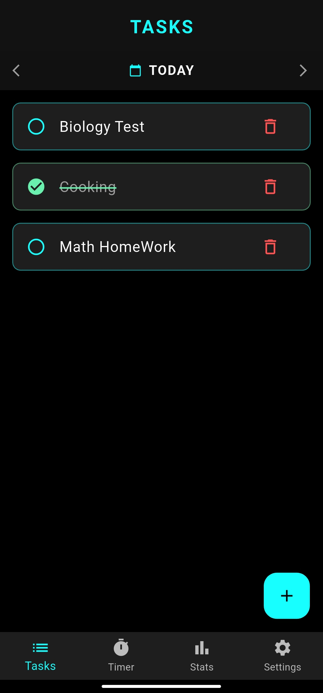
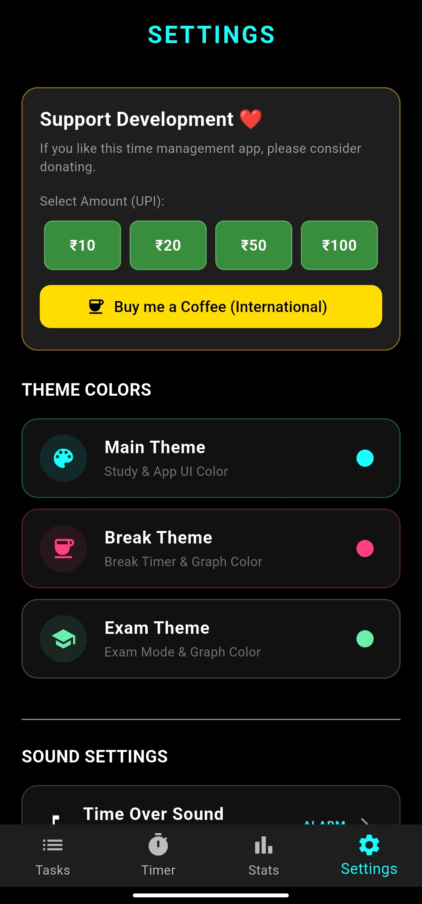

<div align="center">

  

  # ⏳ Time Manager
  
  **Master Your Time, Master Your Life.**
  
  [](https://flutter.dev/)
  [](https://www.android.com/)
 [](https://www.gnu.org/licenses/gpl-3.0)
  [](https://f-droid.org/)

  <p>
    <a href="#-features">Features</a> •
    <a href="#-screenshots">Screenshots</a> •
    <a href="#-download">Download</a> •
    <a href="#-installation">Installation</a> •
    <a href="#-support">Support</a>
  </p>

</div>

---

## 🚀 Introduction

**Time Manager** is a powerful, offline, and privacy-focused productivity app designed to help you focus on your studies and work. Whether you use the **Pomodoro technique**, need a stopwatch for **Study Sessions**, or want a rigorous **Exam Mode**, this app has it all.

Built with ❤️ using Flutter, it is optimized to run smoothly in the background, even on devices with strict battery optimization (like MIUI/Redmi).

## ✨ Features

### ⏱️ Multiple Timer Modes
- **StudyWatch:** A simple stopwatch to track your daily study hours.
- **Pomodoro:** Classic 25m/5m focus technique with customizable rounds.
- **Exam Mode:** A strict countdown timer for simulating real exams.

### 🔔 Smart Notification System
- **Sticky Mode Toggle:** You choose! Keep the notification permanent (to prevent accidental swipes) or dismissible.
- **Background Service:** The timer keeps running even if you close the app.
- **Redmi/MIUI Fix:** Includes a dedicated **"EXIT APP"** button in the notification to forcefully stop the service on stubborn devices.

### 📊 Analytics & Insights
- **Detailed Graphs:** Visualize your study trends (Weekly, Monthly, Yearly).
- **Streak Tracker:** Keep your learning streak alive!
- **Subject-wise Breakdown:** See which subject you studied the most.

### 🎨 Customization
- **Themes:** Custom colors for Study, Break, and Exam modes.
- **Sounds:** Choose your favorite alarm and ticking sounds.
- **Privacy First:** All data is stored locally on your device. No internet required.

---

## 📱 Screenshots

| Home Screen | Timer Running | Statistics | Settings |
|:---:|:---:|:---:|:---:|
|  |  |  |  |

*(Note: Upload images to a 'screenshots' folder in your repo to see them here)*

---

## 📥 Download

You can download the latest APK from the [Releases Page](https://github.com/Saqib791/TimeManager/releases).

1. Go to **Releases**.
2. Download `TimemManager.apk`.
3. Install and enjoy!

---

## 🛠️ Installation (For Developers)

If you want to build this app from source:

1. **Clone the repository:**
   ```bash
   git clone [https://github.com/Saqib791/TimeManager.git](https://github.com/Saqib791/TimeManager.git)
2. **Navigate to the project folder:

cd TimeManager
3. **Install dependencies:

flutter pub get
3. **Run the app:

flutter run
cd TimeManager

3. **Install dependencies:

flutter pub get

3. **Run the app:

flutter run

## 🤝 Contributing
Contributions are welcome! If you have an idea or found a bug, feel free to open an issue or submit a pull request.

Fork the Project

Create your Feature Branch (git checkout -b feature/NewFeature)

Commit your Changes (git commit -m 'Add some NewFeature')

Push to the Branch (git push origin feature/NewFeature)

Open a Pull Request

❤️ Support
If you find this app helpful, you can support the development!

<a href="https://buymeacoffee.com/saqib791">
  
</a>

UPI ID: saqibqamar7866@okicici

## 📄 License

This project is licensed under the **GNU General Public License v3.0** - see the [LICENSE](LICENSE.md) file for details.

Copyright (c) 2025 Mohd Saqib Qamar

<div align="center"> Made with ❤️ by <b>Mohd Saqib Qamar</b> </div>
